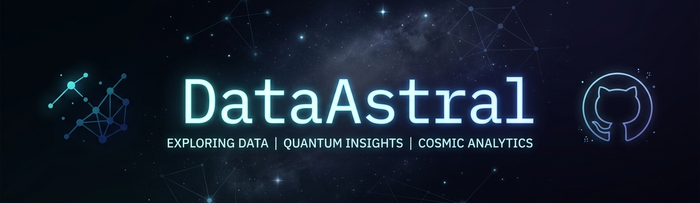

# 🦾 DataAstral

One million projects. One path to mastery.

Progress: [░░░░░░░░░░] 0.0001% complete

---

DataAstral — one million projects journey  
Computer Science student (UK)  
Building skills in Automation, AI & Data  

---

## 📁 Current Projects

💻 1M Python Journey  
→ https://github.com/DataAstral/1m-python-journey  

💻 One Million Projects Journey  
→ https://github.com/DataAstral/OneMillionProjectsJourney  

---

## Project Roadmap (in progress)

This GitHub is being built as a structured ecosystem:

- 1m-python-journey → daily Python learning  
- OneMillionProjectsJourney → all projects across domains  
- low-code-automation → automation tools (Make, Zapier, n8n)  
- python-automation-scripts → real automation scripts  
- python-testing-lab → testing (pytest, API, unit tests)  
- data-playground-python → data analysis & notebooks  
- ai-experiments-python → machine learning experiments  
- portfolio-projects → best junior-level projects  

🚧 Currently building step by step  

---

## Skills

- Python (beginner → growing)  
- Git & GitHub  
- Problem solving  
- Structured learning  

---

## Progress

Progress: [░░░░░░░░░░] 0.0001% complete  

---

## Contact

- GitHub: https://github.com/DataAstral  

---

⭐ Building in public. Learning by doing.
